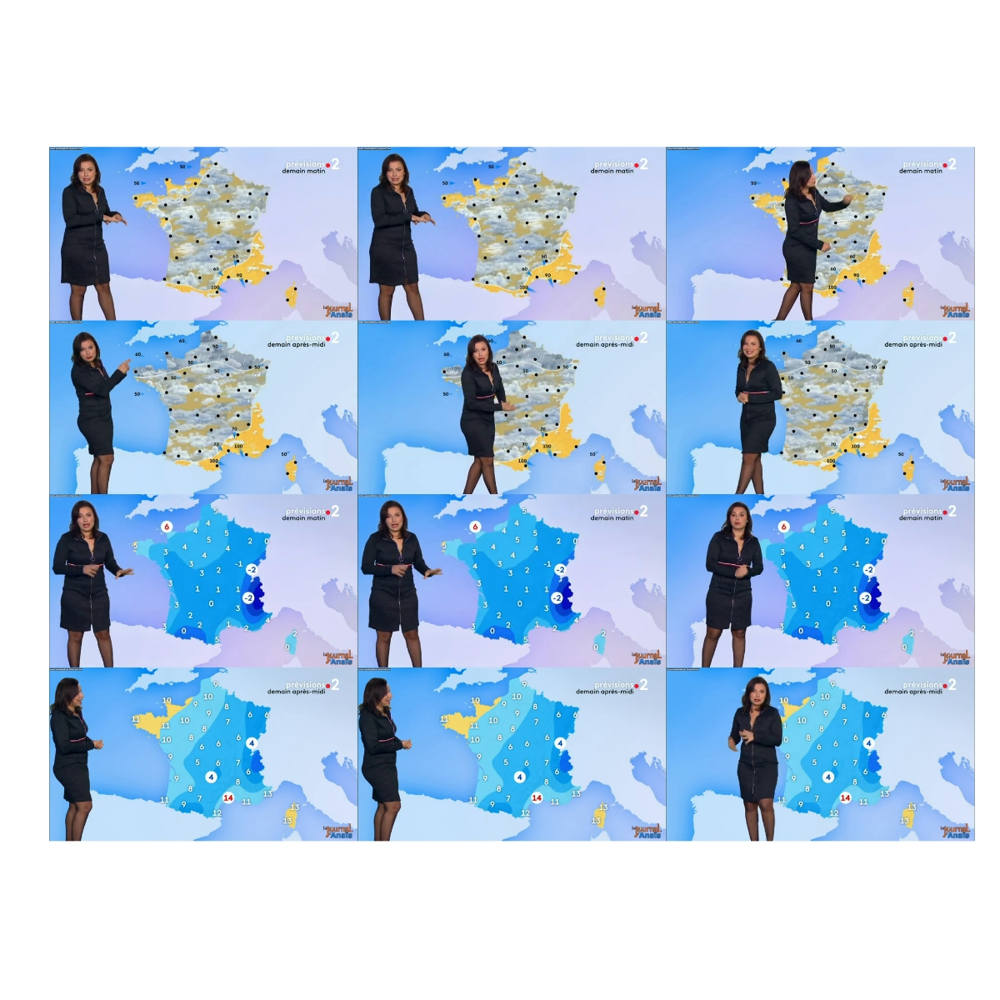

# Comment j'ai quantifié les inégalités de traitement météorologiques entre Vannes et Strasbourg


## Introduction (Epic version) 

Normand de naissance et de coeur, je n'ai jamais accordé une place très importante aux différents bulletins météo, ne sachant que trop bien ce dont allait être faite la journée. Ayant eu le privilège de connaître des personnes venant d'autres horizons, notamment de la lointaine et exotique Bretagne, j'ai réalisé que, dans d'autres lieux, les informations météorologiques pouvaient apporter autre chose que "Bah demain, y r'pleut". Avec plusieurs expériences de bulletins météo télévisés et une formation de datajournaliste derrière moi, je me suis retrouvé un soir sur un canapé devant un constat et un défi : pourquoi la dame de la météo (ça a toujours été une dame quand j'ai regardé) commente les températures des villes orientales en se plaçant au dessus de la Bretagne, laissant ainsi aux intéressés d'autant moins de temps pour voir et lire les informations par elle obstruées et ne pourrait-on pas mesurer cette inégalité d'accès à l'information ?

Ceci est mon histoire.

## Introduction (Honest version) 

Ce projet, complètement con sur le fond, consiste à tenter de mesurer les variations autour de zones sur une vidéo. Je m'y suis penché en me disant que ce serait une occasion de faire de me faire la main sur du machine learning, pis en fait non.

## Principes 

### Matériau

- Source vidéo : Je me suis appuyé sur le bulletin météo de France 2 précédant le journal de 20h, tel qu'il a été posté sur la chaîne Youtube de Anaïs Baydemir (la fameuse dame de la météo). 
- Logiciel : ffmpeg et R, avec les packages imagemagick, tidyverse et colorscale.

### Principe du bulletin météo

Une dame rentre dans le champ de la caméra sur un fond vert, des images ou des cartes défilant dans le fond. On ne va s'intéresser ici qu'aux séquences relatives l'allure du ciel : nuages, pluie, ciel bleu, etc (que j'appelle prévisions ici) pour le matin et pour l'après-midi et aux températures pour le matin et pour l'après-midi. Le niveau de zoom sur la métropole est le même tous les jours; la surface n'est donc pas modifiée d'un jour sur l'autre.

## Principe du projet

1. Flux vidéo --> listes d'images

Impossible de récupérer les fichiers vidéos des bulletins récents via france.tv, je me suis donc appuyé sur [la chaîne Youtube de Anaïs Baydemir](https://www.youtube.com/channel/UCCjC5WdWYmqLnuwILaJ2Lew), dont j'ai récupéré les fichiers mp4 par un site en ligne ([yt1s.io])(https://yt1s.io), puis renommé avec la date en format DDMMYYYY.
Après avoir essayé différentes techniques, c'est avec `ffmpeg` que j'ai pu sortir un nombre suffisamment important d'images pour chacun des mp4 générés (5 par seconde).

```
system("ffmpeg -i METEO_ZONE/01012019.mp4 -r 5 -f image2 METEO_ZONE/img_01012019_%05d.png")
```

2. Extraction des images avec une carte de France

Le package `imagemagick` permet une lecture de texte dans des images. J'ai donc, dans un premier temps, tenté de délimiter quelles étaient les images relatives aux prévisions ou températures du matin selon ce que le texte présent dans l'image indiquait. Toutefois, certaines images se trouvaient zoomées sur certaines parties de l'hexagone sans que cela ne puisse être détectable. 
J'ai donc changé mon fusil d'épaule et suis passé sur une sélection à la main d'une image de référence, une image de début et de fin de la séquence, pour chaqune des 4 séquences. Par exemple, dans l'image ci-dessous, la première colonne représente l'image de référence : celle qui est la plus dégagée de la séquence, la seconde représente la première image de la séquence et la dernière colonne représente la dernière image de la séquence. 
La première ligne représente les prévisions du lendemain matin.
La seconde représente les prévisions du lendemain après-midi.
La troisième représente les températures du lendemain matin.
La quatrième et dernière représente les températures du lendemain après-midi.




3. Découpage de la carte de métropole en zones

Une fois l'image découpée, je conserve uniquement la forme de la métropole. Je scinde ensuite cette forme en une série de zones hexagonales de 10 pix de côté, ce qui fait un peu plus de 660 zones sur notre carte.

4. Estimation de la couleur médiane par zone de la carte sans présentatrice (référence)

Pour pouvoir déterminer l'état de chaque zone, j'ai choisi de me fier à sa couleur et au fait qu'elle variait plus ou moins de son niveau de référence. Par exemple : une zone ensoleillée est présentée en jaune dans la carte de référence. Je considère qu'elle est couverte par la présentatrice si sa couleur est modifiée. En termes de codages, je récupère la couleur de chaque pixel de la carte, en rouge, vert et bleu; et considère que la couleur de la zone est la médiane du niveau de rouge, de vert et de bleu sur chacun des pixels de cette zone.
On récupère ainsi un tableur avec une couleur de référence pour chaque hexagone, pour chaque séquence (prévision matin et après-midi, températures matin et après-midi).

5. Estimation de la couleur médiane par zone de la carte pour chaque image relative à la séquence

Pour les autres images de chaque séquence, on fait le même travail. 

6. Estimation de la distance moyenne par zone entre la référence et la séquence

On rapporte la couleur obtenue pour chaque zone de chaque image de la séquence à la couleur de référence de la séquence pour en estimer la distance, avec l'excellent package `colorscale`. 
Avantage de cette façon de faire : on peut prendre en compte les différences dans les couleurs des zones, quelles que soient ces couleurs.
Inconvénient : 
- la séquence de prévision météo utilisant parfois des signalétiques animées (des nuages allant de droite à gauche), l'image de référence ne prend la couleur médiane d'une des phases de cette animation. 
- la présentatrice n'étant pas habillée de pied en cap de la même couleur, la présence de sa main, de ses cheveux ou de sa robe sur une même zone créera une distance différente sur la zone, bien que le résultat soit le même pour le spectateur : une zone cachée.

## Résultats
